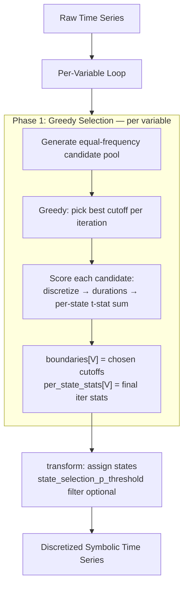

# TID3 — Time Interval Duration-based Discretization

TID3 is a supervised temporal abstraction method that discretizes continuous time-series variables into symbolic states by selecting cutoff boundaries that **maximize the statistical difference in state durations between classes**.

Unlike distribution-based methods (e.g., TD4C, equal-width, equal-frequency), TID3 exploits the *temporal structure* of the data: it considers how long entities spend in each state, and whether that duration differs between class 0 and class 1.

## Table of Contents

- [Core Idea](#core-idea)
- [Parameters](#parameters)
- [Univariate Mode (`tid3`)](#univariate-mode-tid3)
- [Multivariate Mode (`tid3_mv`)](#multivariate-mode-tid3_mv)
- [Phase 2 Logging](#phase-2-logging)
- [Flow Diagrams](#flow-diagrams)
- [Scoring Methods](#scoring-methods)
- [Configuration Strings](#configuration-strings)
- [Key Code Locations](#key-code-locations)

---

## Core Idea

Given a continuous time-series variable (e.g., heart rate over time), TID3 needs to choose cutoff values to divide the range into `bins` discrete states. For example, with 3 bins and cutoffs `[60, 100]`, heart rate values become:
- State 0: HR < 60
- State 1: 60 <= HR < 100
- State 2: HR >= 100

The key insight: **different cutoffs produce different state durations**. A cutoff that aligns with natural value clusters creates long, stable intervals (high durations), while a cutoff that falls in the middle of a cluster creates frequent state switches (short durations). TID3 searches for cutoffs where these durations are **maximally different between classes**.

---

## Parameters

| Parameter | Default | Description |
|-----------|---------|-------------|
| `bins` | (required) | Number of discrete states to create |
| `scoring_method` | `max_t_stat_sum` | How to score cutoff quality. **Only `max_t_stat_sum` is supported in the current build** — see [Scoring Methods](#scoring-methods). |
| `duration_preference` | `two_sided` | Direction preference: `two_sided`, `class1_longer`, `class0_longer` |
| `nb_candidates` | `100` | Number of equal-frequency candidate cutpoints per variable |
| `max_gap` | `1` | Max gap between consecutive timestamps to merge into one STI |
| `min_duration_threshold` | `2` | Minimum STI duration (consecutive same-state observations) to keep |
| `min_mean_gap` | `0.0` | Phase 1 only. Min absolute difference between the pooled mean durations of a candidate's two child bins. Candidates below this gap are skipped before scoring; if no feasible candidate exists at the root iteration, the variable is dropped from output (and routed through `fallback_method` if set). Default `0.0` preserves original behaviour exactly. |
| `multivariate_refinement` | `False` | Enable Phase 2 conditional intra-variable greedy refinement |
| `num_relations` | `3` | Allen relations used in Phase 2: 3 (before/overlap/contain) or 7 (full algebra) |
| `mv_top_tirps` | `100` | Phase 2 only. Sum the top-K `|t|` values across pattern keys and divide by K (zero-padded). `-1` divides by the actual scorable count instead. |
| `mv_variable_order` | `univariate_score_desc` | Phase 2 visit order: `univariate_score_desc`, `univariate_score_asc`, or `random` |
| `mv_random_seed` | `None` | Seed for `numpy.random.default_rng` when `mv_variable_order == "random"`; ignored otherwise |
| `state_selection_p_threshold` | `None` | If set, `transform()` maps states whose final per-state p-value exceeds this threshold (or that are absent from `per_state_stats`) to `-1`. Default `None` keeps all states. |
| `fallback_method` | `"td4c"` | Discretization used when TID3 cannot meaningfully handle a variable (e.g. all STIs are duration-1, or root-skipped under `min_mean_gap`). Currently only `"td4c"` or `None`. |
| `fallback_td4c_distance` | `"cosine"` | Distance passed to the TD4C fallback: `cosine`, `kullback_leibler`, or `entropy`. Ignored when `fallback_method` is `None`. |

---

## Univariate Mode (`tid3`)

Standard TID3 processes each variable **independently**. Each variable gets its own `TID3` instance and runs a single phase: greedy cutoff selection.

### Phase 1: Greedy Cutoff Selection

For a variable with `bins = 4` (i.e., 3 cutoffs needed):

1. **Generate candidate pool**: Create up to `nb_candidates` (default 100) equal-frequency quantile cutpoints from the variable's value distribution.

2. **Iteration 1** — select first cutoff:
   - For each candidate cutpoint `c`:
     - Discretize all values using cutoffs `[c]` → assigns each timestamp to state 0 or 1.
     - Merge consecutive same-state timestamps into STIs (respecting `max_gap`).
     - Compute STI durations per state per class.
     - Score: per-state Welch's t-statistic on duration distributions between class 0 and class 1, summed.
     - (If `min_mean_gap > 0`, candidates whose two child-bin mean durations differ by less than the gap are skipped before scoring.)
   - Select the candidate with the highest score → `cutoff_1`.

3. **Iteration 2** — select second cutoff:
   - For each remaining candidate `c`, score `[cutoff_1, c]` (3 states). Argmax → `cutoff_2`.

4. **Iteration 3** — select third cutoff:
   - Same process with `[cutoff_1, cutoff_2, c]` (4 states). Argmax → `cutoff_3`.

5. **Result**: `boundaries[V] = [cutoff_1, cutoff_2, cutoff_3]`. Per-state t/p stats from the final iteration are stored in `per_state_stats[V]` for optional p-value filtering.

### Edge cases

- **Empty stats / duration-1 STIs**: variables whose STIs all collapse to a single timestamp produce no per-state stats. If `fallback_method="td4c"` is set, those variables are re-discretized with TD4C; otherwise their stats stay empty and they appear in output without per-state filtering.
- **Root infeasibility under `min_mean_gap`**: if no candidate satisfies the mean-duration-gap constraint at iteration 1, the variable is dropped from `self.boundaries` (and routed to TD4C if the fallback is enabled).

### Orchestration

In the pipeline (`core.py`), univariate TID3 is instantiated **per variable** inside the per-variable loop. Each variable's `TID3` calls `fit_transform()` on that variable's data alone. Variables never interact.

---

## Multivariate Mode (`tid3_mv`)

The MV variant runs **two phases**:

1. **Phase 1** — exactly the same per-variable greedy cutoff selection as univariate mode, run for all variables. The result is the *univariate-best* cutoffs `boundaries[V]`, the final scores `final_scores_per_tpid[V]`, and the per-state stats `per_state_stats[V]`.
2. **Phase 2** — **conditional intra-variable greedy** refinement that visits variables in `mv_variable_order` and re-picks each non-first variable's cutoffs by scoring against the *locked-in* states of every previously committed variable.

Phase 2 implements a Karma-style size-2 TIRP score **inline within TID3** — it does NOT call the KarmaLego framework. The logic is adapted from `Karma_New_TID3.py` but runs directly on in-memory STIs.

### Phase 1 (MV mode)

Identical to univariate Phase 1, run for every variable. After Phase 1, each variable has its own univariate-best cutoffs ready to be either kept (V_1) or re-picked (V_2, V_3, …) by Phase 2.

### Phase 2: Conditional Intra-Variable Greedy

#### Variable order

Variables are visited in `self.mv_variable_order`:

- `univariate_score_desc` *(default)* — descending by `final_scores_per_tpid`, tie-break by TPID ascending. Strongest univariate signal first.
- `univariate_score_asc` — same, ascending.
- `random` — deterministic permutation seeded by `mv_random_seed`.

TPIDs missing a univariate score (e.g. TD4C-fallback variables) are treated as score `0.0` for sorting.

#### Step-by-step

Let `order = [V_1, V_2, ..., V_N]`. Phase 2 maintains a dict `fixed_intervals` mapping each already-committed variable to its STI dict (`{entity_id: [(start, end, symbol_id, var_id), ...]}`).

1. **k = 1 (V_1)**: Keep univariate-best cutoffs. Lock in `fixed_intervals[V_1] = raw_to_STIs(df_V1, boundaries[V_1], V_1)`. No scoring happens — V_1 is the reference.

2. **k ≥ 2 (V_k)**:

   a. Build a fresh equal-frequency candidate pool for V_k (same call Phase 1 makes).

   b. Initialize `chosen_cutoffs = []`. For iteration `i = 1..bins-1`:
      - For each remaining candidate `c`:
        - `tentative = sorted(chosen_cutoffs + [c])`
        - `vk_STIs = raw_to_STIs(df_Vk, tentative, V_k)`
        - For every `V_j` already in `fixed_intervals`, compute `_compute_cross_durations(fixed_intervals[V_j], vk_STIs)` → a dict keyed by `"<sym_Vj>_<sym_Vk>_<allen_relation>"` with `{class_id: [durations]}` values.
        - `merged = _merge_cross_durations(per_pair_dicts)` (concatenate duration lists per pattern key).
        - `score(c) = _score_cross_variable(merged)` — the average of the top-K `|Welch's t|` across pattern keys, divided by `mv_top_tirps` (or by the actual scorable count if `mv_top_tirps == -1`). For directional `duration_preference`, only same-sign t-statistics contribute.
      - Commit the argmax candidate to `chosen_cutoffs`. Remove it and any near-duplicates from the candidate pool.

   c. After `bins-1` iterations (or early-stop if no valid candidate remains):
      - `boundaries[V_k] = chosen_cutoffs`
      - `fixed_intervals[V_k] = raw_to_STIs(df_Vk, chosen_cutoffs, V_k)` (now V_k is locked too)
      - `per_state_stats[V_k]` is refreshed against the new MV-chosen cutoffs so any p-value filtering in `transform()` stays consistent.

3. Repeat until every variable in `order` has been visited.

#### Why "conditional" greedy

Each new V_k is scored against the **static** STIs of V_1..V_{k-1}, which never change during V_k's iterations. Within V_k, the search is itself greedy (pick one cutoff per inner iteration, never revisit). This is order-dependent by design: a different `mv_variable_order` produces a different (still locally optimal) result. The trade-off is computational tractability — joint enumeration over all variables' candidate sets is exponential in N, while conditional greedy is linear in N inside the outer loop.

#### Worked example: V_1 → V_2 with `bins = 3`

Setup: `bins = 3`, `nb_candidates = 100`, two entities (e1 class 0, e2 class 1). Order `[V_1, V_2]` (V_1 has the higher univariate t-stat-sum).

**k = 1: V_1**

Phase 1 had picked V_1 cutoffs `[10, 20]` (univariate-best). Phase 2 keeps them. `raw_to_STIs(df_V1, [10, 20], V_1)` produces STIs whose `symbol_id = V_1 * (bins+1) + state = V_1 * 4 + state`. Stored in `fixed_intervals[V_1]`. No scoring happens.

**k = 2: V_2 (greedy, 2 cutoffs to pick)**

Phase 1 had picked V_2 cutoffs `[c, d]`. Phase 2 throws those away for V_2 and starts fresh:

- *Iter 1* (`chosen_so_far = []`): for every candidate `c` in V_2's fresh pool, tentative cutoffs `= [c]` → V_2 STIs temporarily have 2 states. `_compute_cross_durations(fixed_intervals[V_1], vk_STIs)` returns a dict like `{"<sym_V1>_<sym_V2>_<rel>": {0: [...], 1: [...]}}`. The argmax candidate becomes `chosen_so_far[0]`.
- *Iter 2* (`chosen_so_far = [winner_1]`): for each remaining `c`, tentative `= sorted([winner_1, c])` → V_2 STIs now have 3 states (the target `bins`). Cross-durations are recomputed against the *same* `fixed_intervals[V_1]`. Argmax candidate is appended → final V_2 cutoffs `= sorted([winner_1, winner_2])`.

**Commit**: `boundaries[V_2] = chosen_cutoffs`. `fixed_intervals[V_2]` is computed and from now on V_2 is *also* a locked reference. With `N = 2` Phase 2 ends here; with more variables, V_3 would be next, scored against both `fixed_intervals[V_1]` and `fixed_intervals[V_2]`.

Observations the run reliably produces:
- Scores rise monotonically across V_k's iterations (more states ⇒ more pattern keys ⇒ larger top-K sum).
- The set of fixed variables grows by exactly one per outer step.
- Within an outer step, the fixed reference set is **constant** across all inner iterations — exactly the "static cutoffs of previous variables" property Phase 2 is designed to expose.

### Orchestration (MV mode)

MV mode requires special handling in `core.py` because the default pipeline processes variables one at a time:

1. **Step 1.5** (before the per-variable loop): detect the `mv` flag in the method string, create a **single TID3 instance** on ALL variables, and call `fit()` — this runs Phase 1 + Phase 2 with full cross-variable context.
2. **Step 2** (per-variable loop): instead of `fit_transform()`, call `transform()` on the pre-fitted instance to reuse the refined boundaries.

---

## Phase 2 Logging

Phase 2 emits structured `[MV_REFINE_GREEDY]` lines to both the logger (`INFO`) and stdout. They make the conditional-greedy contract auditable from a single log file.

### Start-of-phase header

```
[MV_REFINE_GREEDY] Start: N variables, order_scheme=<scheme>, order=[V_1, V_2, ..., V_N]
```

### Per outer step (V_k)

- **k = 1**: a single line confirming V_1 keeps its univariate-best cutoffs:
  ```
  [MV_REFINE_GREEDY] Step 1/N: var=V_1 — kept univariate-best (no fixed variables yet), cutoffs=[...]
  ```
- **k ≥ 2**: a fixed-context block, then one line per inner iteration, then a closing summary.

#### Fixed-context block (k ≥ 2)

```
[MV_REFINE_GREEDY] Step k/N, var=V_k: scoring against k-1 fixed variable(s) [V_1, V_2, ...]
[MV_REFINE_GREEDY]   fixed V_1: cutoffs=[...] states=[...] symbols=[...]
[MV_REFINE_GREEDY]   fixed V_2: cutoffs=[...] states=[...] symbols=[...]
...
```

- `cutoffs` come from `self.boundaries[V_j]`.
- `states` are the unique state IDs currently present in `fixed_intervals[V_j]`, recovered inline as `state = symbol_id - V_j * (bins + 1)`.
- `symbols` are the raw symbol IDs observed in `fixed_intervals[V_j]`.

This block prints **before V_k's first iteration**, so a reader can verify which states of which previous variables V_k is about to be scored against.

#### Per inner-iteration line

```
  [MV_REFINE_GREEDY]   Step k/N, var=V_k, iter i/(bins-1): winner=<value> (score=<float>) | chosen_so_far=[...] | fixed_vars=[V_1, V_2, ...]
```

- `winner` and `score` describe the argmax candidate at this iteration.
- `chosen_so_far` is V_k's cutoff list **before** appending the winner — proves the greedy build-up inside V_k.
- `fixed_vars` is `list(fixed_intervals.keys())` and is **constant across iterations of the same V_k**. The log prints it on every iteration as a sanity check that the reference set isn't moving while V_k's cutoffs are being chosen.

#### Closing summary (per V_k)

```
[MV_REFINE_GREEDY] Step k/N: var=V_k complete: cutoffs=[...], changed=Y|N
[MV_REFINE_GREEDY] Step k/N: var=V_k UPDATED before=[...] -> after=[...]
```

`changed=Y` means Phase 2 picked different cutoffs from the Phase 1 univariate-best; `changed=N` means it picked the same ones.

### End-of-phase summary

```
[MV_REFINE_GREEDY] Complete: <changed_count>/N variables refined, ordering=<scheme>
```

### Quick validation checklist

When reading the log, the following invariants should hold for a correct run:

- V_1 (k = 1) does **not** print a fixed-context block.
- At step k, the fixed-context block lists exactly `k-1` variables, and they are the first `k-1` entries of `order`.
- `fixed_vars` in every inner-iteration line is identical across iterations of the same V_k.
- `chosen_so_far` at iter 1 is `[]`; at iter 2 it contains the iter-1 winner; etc.
- Symbol IDs decode back to their advertised states via `state = symbol - V_j * (bins + 1)`.
- Per-iteration scores rise monotonically within a single V_k (more states ⇒ more pattern keys).

---

## Flow Diagrams

### Univariate TID3 (`tid3`)



### Multivariate TID3 (`tid3_mv`)

```mermaid
flowchart TD
    A[Raw Time Series] --> PRE[Fit single TID3 on ALL variables]
    PRE --> P1

    subgraph P1 [Phase 1: Greedy — per variable]
        B[Generate equal-frequency candidate pool per variable] --> C[Greedy: pick best cutoff per iteration<br>same procedure as univariate]
        C --> D["boundaries[V] = univariate-best<br>final_scores_per_tpid[V] recorded"]
    end

    D --> P2

    subgraph P2 [Phase 2: Conditional Intra-Variable Greedy]
        E[Sort variables by mv_variable_order] --> F[V_1: keep univariate-best, lock STIs]
        F --> G[For each V_k k>=2 in order]
        G --> H[Fresh candidate pool for V_k]
        H --> I[Greedy: pick V_k cutoffs one at a time<br>score against locked STIs of V_1..V_{k-1}]
        I --> J["boundaries[V_k] = MV-chosen<br>fixed_intervals[V_k] = locked"]
        J --> G
    end

    J --> T[transform: assign states<br>refreshed per_state_stats consistent with MV cutoffs]
    T --> OUT[Discretized Symbolic Time Series]
```

### Comparison: `tid3` vs `tid3_mv`

```mermaid
flowchart LR
    subgraph uni ["tid3 (univariate)"]
        U1[Phase 1: Greedy<br>1 best per iter] --> U2[boundaries per var]
        U2 --> U3[Per-var fit_transform<br>variables independent]
    end

    subgraph mv ["tid3_mv (multivariate)"]
        M1[Phase 1: Greedy<br>univariate-best per var] --> M2[Phase 2: Conditional greedy<br>in mv_variable_order]
        M2 --> M3[V_1 kept · V_k>=2 re-picked<br>against locked V_1..V_{k-1}]
        M3 --> M4[Per-var transform<br>refined boundaries]
    end
```

---

## Scoring Methods

**The current build supports only one scoring method: `max_t_stat_sum`** (sum of per-state Welch's t-statistics on STI duration distributions). The TID3 constructor raises `ValueError` for any other value.

The parser at `Hugobot2/ta_package/utils.py:parse_tid3_config()` has been trimmed to match: `TID3_SCORING_MAP = {"tstat": "max_t_stat_sum"}`. The legacy shorthands (`_ks`, `_kl`, `_mw`, `_ws`, `_avgdiff`, `_selftrans`) no longer parse and will raise `ValueError` at parse time. Re-introduce them in `TID3_SCORING_MAP` if/when the corresponding scorers are re-added to `TID3.AVAILABLE_SCORING_METHODS`.

### Duration Preference

| Option | Effect |
|--------|--------|
| `two_sided` | Any difference counts (two-tailed tests). |
| `class1_longer` | Only reward cutoffs where class 1 has longer durations (one-tailed). |
| `class0_longer` | Only reward cutoffs where class 0 has longer durations (one-tailed). |

Directional preferences also propagate to Phase 2's cross-variable scoring (`_score_cross_variable`).

---

## Configuration Strings

The method name string encodes TID3 parameters:

```
tid3[_mv][_<duration_pref>][_mingap<value>][_<nb_candidates>]
```

`<value>` in `mingap<value>` uses `p` as the decimal separator (e.g. `mingap0p1` → `min_mean_gap = 0.1`).

| Method string | MV | Scoring | Duration pref | nb_candidates | min_mean_gap |
|---|---|---|---|---|---|
| `tid3` | No | max_t_stat_sum | two_sided | default 100 | 0.0 |
| `tid3_mv` | Yes | max_t_stat_sum | two_sided | default 100 | 0.0 |
| `tid3_c1longer` | No | max_t_stat_sum | class1_longer | default 100 | 0.0 |
| `tid3_mv_c1longer` | Yes | max_t_stat_sum | class1_longer | default 100 | 0.0 |
| `tid3_c0longer` | No | max_t_stat_sum | class0_longer | default 100 | 0.0 |
| `tid3_mv_c0longer` | Yes | max_t_stat_sum | class0_longer | default 100 | 0.0 |
| `tid3_150` | No | max_t_stat_sum | two_sided | 150 | 0.0 |
| `tid3_mv_mingap0p1` | Yes | max_t_stat_sum | two_sided | default 100 | 0.1 |
| `tid3_mv_mingap0p5_100` | Yes | max_t_stat_sum | two_sided | 100 | 0.5 |

Parsing happens in two passes inside `Hugobot2/ta_package/utils.py`: `strip_mingap_suffix()` first extracts any `mingap<value>` token, then `parse_tid3_config()` parses the remaining string into `(scoring_method, duration_preference, multivariate_refinement, nb_candidates)`.

Parameters not exposed via the config string (`mv_variable_order`, `mv_random_seed`, `state_selection_p_threshold`, `fallback_method`, `fallback_td4c_distance`, `num_relations`, `mv_top_tirps`) must be set on the `TID3(...)` constructor directly when wiring the method up programmatically (see `run_stage1_abstraction.py:build_method_config()`).

---

## Key Code Locations

| Component | File | Function / section |
|-----------|------|-----------------|
| TID3 class definition | `Hugobot2/ta_package/methods/tid3.py` | `class TID3` |
| Constructor + parameter validation | `tid3.py` | `TID3.__init__()` |
| Main fit (Phase 1 + Phase 2) | `tid3.py` | `TID3.fit()` |
| Greedy candidate-pool driver | `tid3.py` | `_run_greedy_search()` |
| Candidate evaluation (with `min_mean_gap` gate) | `tid3.py` | `_evaluate_candidate_pool()` |
| Search-context preprocessing | `tid3.py` | `_build_candidate_search_context()` |
| Cutpoint generation | `Hugobot2/ta_package/utils.py` | `generate_candidate_cutpoints()` |
| Phase 2 driver (conditional greedy) | `tid3.py` | `_multivariate_refinement_greedy()` |
| Phase 2 per-iteration scoring | `tid3.py` | `_score_candidates_cross_variable_iter()` |
| Raw values → Karma-style STIs | `tid3.py` | `raw_to_STIs()` |
| Cross-variable Allen + durations | `tid3.py` | `_compute_cross_durations()` |
| Merge per-pair dicts | `tid3.py` | `_merge_cross_durations()` |
| Allen relation computation | `tid3.py` | `_compute_allen_relation()` |
| Cross-variable score (top-K Welch's t mean) | `tid3.py` | `_score_cross_variable()` |
| Direct duration scoring (per-state t-stat sum) | `tid3.py` | `_score_from_durations_direct()` |
| Transform (apply boundaries + state filter) | `tid3.py` | `TID3.transform()` |
| MV orchestration in pipeline | `Hugobot2/ta_package/core.py` | Step 1.5 + `tid3_mv` dispatch |
| Method name parsing | `Hugobot2/ta_package/utils.py` | `parse_tid3_config()`, `strip_mingap_suffix()` |
| Config building | `run_stage1_abstraction.py` | `build_method_config()` |
| Karma logic reference (not imported) | `New_KarmaLego_Framework/Karma_New_TID3.py` | `KarmaTID3` (adapted inline in `tid3.py`) |
